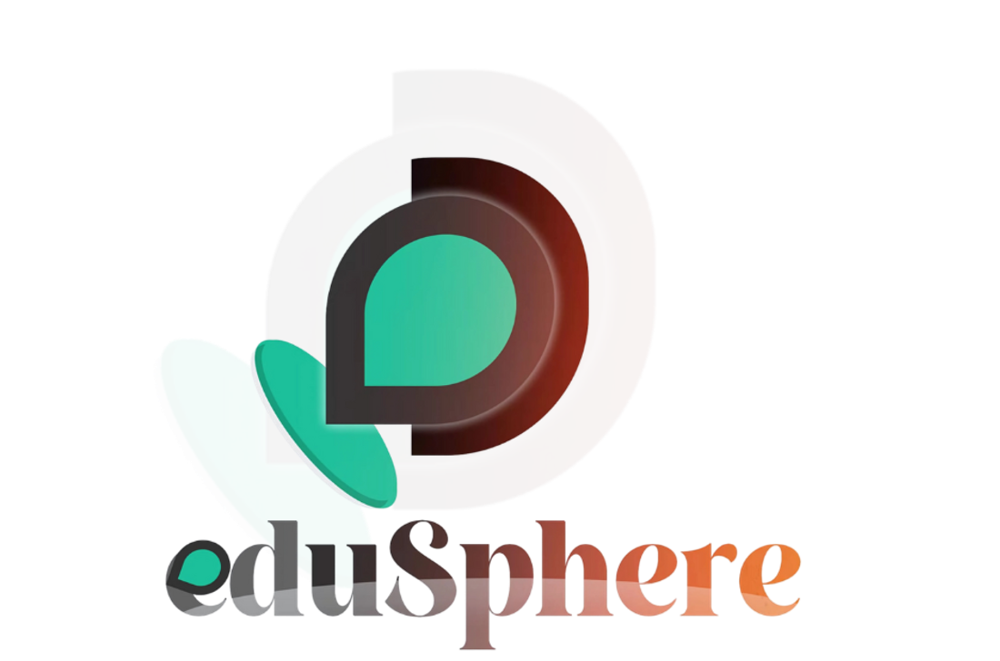
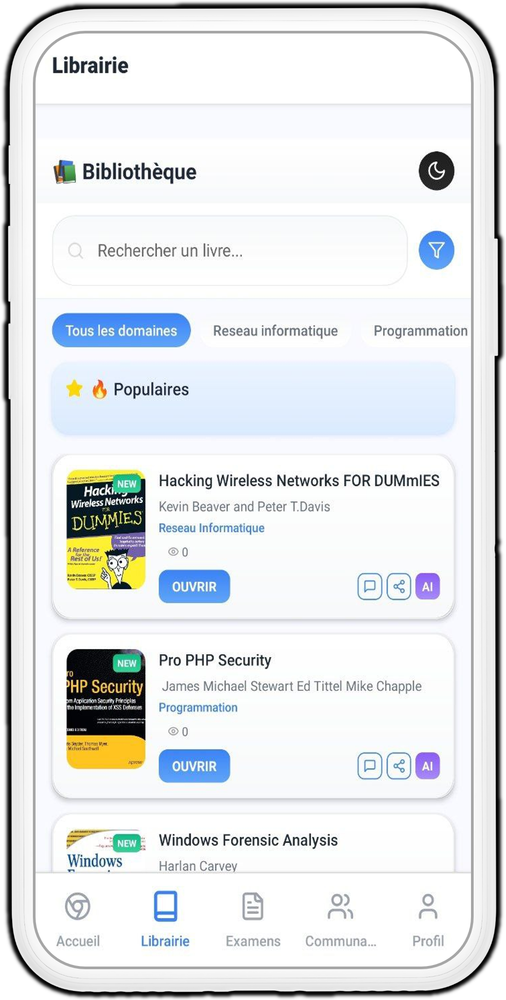
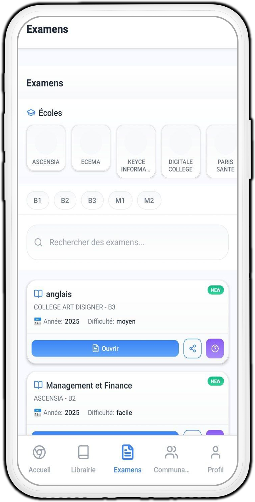
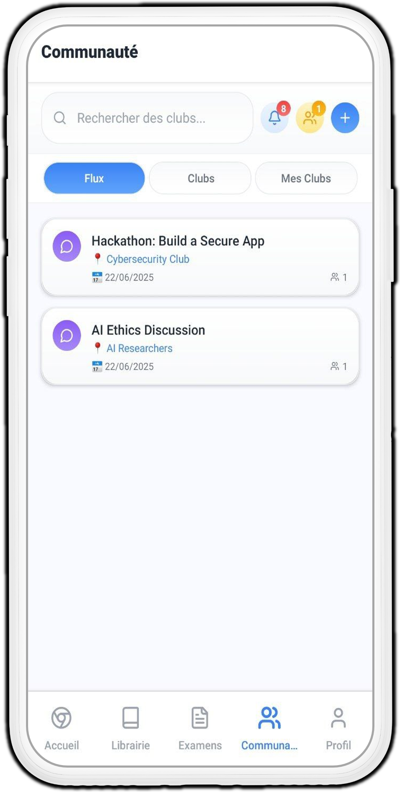
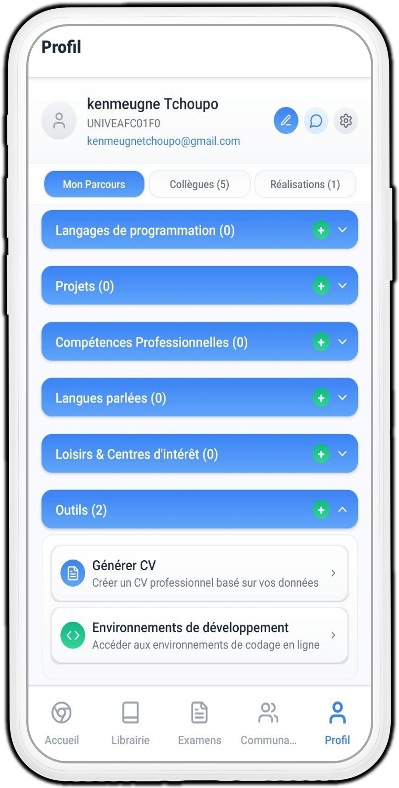
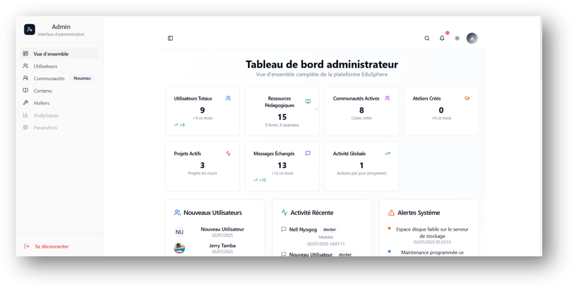

<h1 align="center">

</h1>

<p align="center">
  <strong>🎓 EduSphere - Application d'Apprentissage Collaboratif.</strong><br/>
Cas du Collège de Paris
</p>

<p align="center">
  <!-- React Ecosystem -->
  
  

  <!-- Backend & Database -->
  

  <!-- Frontend Tools -->
  
  
  
  
</p>

---


## 📋 Description du Projet

EduSphere est une application d'apprentissage collaboratif complète développée par l'équipe Edusphere, Cette plateforme révolutionnaire vise à transformer l'éducation en offrant un environnement d'apprentissage interactif, sécurisé et collaboratif pour les étudiants des établissements d'enseignement supérieur.

Le projet comprend deux composantes principales :
- **Application Mobile** : Interface utilisateur principale (Android/iOS)
- **Panneau d'Administration Web** : Interface de gestion et contrôle (Version actuelle)

## 🚀 Fonctionnalités Principales

### 📚 Module Bibliothèque Numérique
- **Catalogue complet** : Accès à une vaste collection de livres académiques
- **Recherche avancée** : Filtrage par domaine, niveau, auteur
- **Lecture sécurisée** : Protection anti-copie et anti-capture d'écran
- **Système d'évaluation** : Avis et recommandations communautaires
- **Synchronisation** : Lecture cross-platform avec sauvegarde de progression


### 🎯 Module Banque d'Épreuves
- **Sélection par établissement** : 7 institutions supportées
- **Organisation par niveau** : B1, B2, B3, M1, M2
- **Historique complet** : Accès aux épreuves des années antérieures
- **Assistance IA** : Aide intelligente pour la résolution d'exercices
- **Notification automatique** : Alerte pour les nouvelles épreuves


### 👥 Module Communauté & Collaboration
- **Clubs thématiques** : Organisation par domaines d'expertise
- **Ateliers privés** : Espaces de travail collaboratif sécurisés
- **Environnements de développement** : VSCode, labs cybersécurité, Packet Tracer
- **Chat en temps réel** : Messagerie multimedia intégrée
- **Défis communautaires** : Compétitions d'apprentissage



### 👤 Module Profil & Développement
- **Gestion complète du profil** : Informations personnelles et académiques
- **Portefeuille de projets** : Suivi et collaboration sur les projets
- **Génération de CV IA** : CV personnalisés selon le type d'entreprise visé
- **Historique d'activité** : Suivi des progrès et réalisations
- **Paramètres de confidentialité** : Contrôle granulaire des données



### 🛠️ Panneau d'Administration (Version Actuelle)
- **Gestion des utilisateurs** : CRUD complet, rôles et permissions
- **Gestion du contenu** : Livres, épreuves, ressources pédagogiques
- **Modération communautaire** : Surveillance des clubs et ateliers
- **Analytics avancées** : Statistiques d'utilisation et performance
- **Configuration système** : Paramètres globaux et sécurité


## 🔧 Technologies Utilisées

### Frontend
- **React** 18+ avec TypeScript
- **Vite** pour le build et développement
- **TailwindCSS** pour le styling
- **Shadcn/UI** pour les composants
- **React Query** pour la gestion d'état

### Backend & Base de Données
- **Supabase** (PostgreSQL + Auth + Storage + Real-time)
- **Row Level Security (RLS)** pour la sécurité
- **Edge Functions** pour la logique métier
- **WebRTC** pour la communication temps réel

### Mobile (Application Principale)
- **React Native** pour iOS/Android
- **Expo** pour le développement rapide
- **Docker** pour les environnements d'ateliers
- **WebView** pour l'intégration des IDE

### Intelligence Artificielle
- **Google Gemini API** pour l'assistance pédagogique
- **Modèles spécialisés** pour la résolution d'exercices

## 📦 Installation et Déploiement

### Prérequis
- Node.js 18+
- Git
- Compte Supabase
- Docker (pour les environnements d'ateliers)

### Installation Locale avec git

```bash
# Cloner le repository
git clone https://github.com/nell852/EDUSPHERE_UP.git
cd EDUSPHERE_UP

# Installer les dépendances
npm install

# Configuration des variables d'environnement
cp .env.example .env.local
# Configurer vos clés API Supabase dans .env.local

# Lancer en mode développement
npm run dev
```

### Accès à l'Application
- **Interface Admin** : `http://localhost:8080/admin`
- **Application Mobile** : Disponible sur Docker Hub

### Application Mobile
```bash
# Télécharger l'image Docker
docker pull nellblaise/edusphere:latest

# Lancer l'application mobile
docker run -p 3000:3000 nellblaise/edusphere:latest
```

## 🔐 Sécurité

### Mesures de Protection Implémentées
- **Authentification Multi-Facteurs** : Protection des comptes administrateurs
- **Chiffrement End-to-End** : Communications sécurisées
- **Row Level Security** : Isolation des données par utilisateur
- **Audit Logging** : Traçabilité complète des actions
- **Protection Anti-Copie** : Prévention des captures d'écran sur contenu sensible

### Conformité et Audits
- **RGPD** : Respect des réglementations européennes
- **Tests de sécurité** : Audits réguliers et tests d'intrusion
- **Sauvegarde automatique** : Protection contre la perte de données
- **Monitoring 24/7** : Surveillance continue de la sécurité

## 🌟 Fonctionnalités Futures

### Phase 2 - Développement Avancé
- **Réalité Augmentée** : Visualisation 3D des concepts académiques
- **Blockchain** : Certification et validation des diplômes
- **Machine Learning** : Personnalisation avancée de l'apprentissage
- **IoT Integration** : Connexion avec équipements de laboratoire

### Phase 3 - Expansion
- **Multi-langue** : Support international
- **API Publique** : Intégration avec systèmes externes
- **Mobile Desktop** : Version desktop native
- **Analytics Prédictive** : Prédiction des performances académiques

## 📊 Performance et Évolutivité

### Capacité Actuelle
- **Utilisateurs simultanés** : 10,000+
- **Stockage de contenu** : 10TB+ de ressources pédagogiques
- **Temps de réponse** : <200ms pour les requêtes standard
- **Disponibilité** : 99.9% uptime garanti
- **Backup Multi-Zone** : Redondance géographique

## 👥 Notre Équipe de Développement

Ce projet a été développé par l'**Équipe EduSphere** :

* **KENMEUGNE TCHOUPO CALIXTE FRANCK**
* **MVELE NYOGOG SILVAN NELL BLAISE**
* **WATONG STENGANG KEVIN DALMA**
* **FONKOU OUMBE BOOZ MELKI**

## 🔗 Liens Utiles et Conteneurs Associés

### Dépôts GitHub

* **Code Source du Panneau d'Administration (actuel)** : [https://github.com/Franck2040/EDUSPHERE_UP_ADMIN](https://github.com/Franck2040/EDUSPHERE_UP_ADMIN)
* **Code Source de l'Application Mobile (Frontend Utilisateur)** : [https://github.com/nell852/EDUSPHERE_UP](https://github.com/nell852/EDUSPHERE_UP)

### Image Docker de l'Application cette application et de la version Mobile 

Pour explorer l'interface utilisateur principale côté étudiant, l'image Docker est disponible ici :
* **Image Docker de l'Application Mobile** : [https://hub.docker.com/r/nellblaise/edusphere](https://hub.docker.com/r/nellblaise/edusphere)

    *Pour la lancer (en utilisant un port différent pour éviter les conflits si le panneau admin est déjà en marche, c'est la meme procédure pour lancer cette partie [admin](https://hub.docker.com/r/franckdev2/edusphere-admin) avec l'image docker) :*
    ```bash
    docker pull nellblaise/edusphere:latest
    docker run -d -p 3000:3000 --name edusphere-mobile nellblaise/edusphere:latest
    ```
    *Puis accédez à :* `http://localhost:3000`

## 📱 Liens Utiles

- **🐳 Docker Hub pour la Version Mobile** : [nellblaise/edusphere](https://hub.docker.com/r/nellblaise/edusphere)
- **🐳 Line Dockerhub de ce projet admin** : [franckdev2/edusphere-admin
](https://hub.docker.com/r/franckdev2/edusphere-admin)
- **📦 Version Mobile de Lapplication sur Github** : [EDUSPHERE_UP](https://github.com/nell852/EDUSPHERE_UP.git)
- **📚 Documentation** : [Guide Complet](./docs/)

## 📄 Licence

Ce projet est développé sous licence propriétaire par **L'Equipe Edusphere**.  
Tous droits réservés © 2025

---

**Version** : 2.0.0 - Admin Panel  
**Dernière mise à jour** : Juillets 2025  
**Contact** : edusphere745@gmail.com
